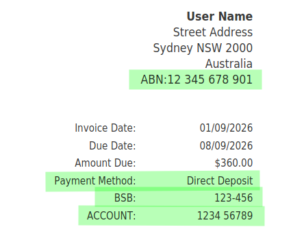
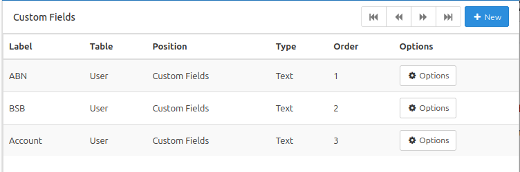
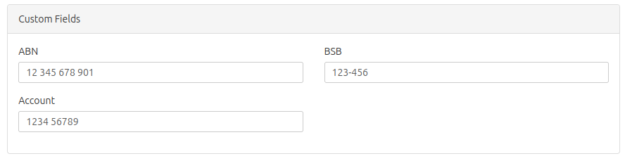

# InvoicePlane-Templates
Invoice Templates for InvoicePlane that incluce ABN, BSB &amp; Acct Numbers

This will add the following section to all 3 invoice types (standard, paid & overdue)

   

1. **Create the following 3 custom fields**

   

2. **Update the fields accordingly**

   You will find these at the bottom of the user form. 

   

3. **Create a payment method `Direct Deposit` case sensitive**

   When creating an invoice, ensure that `Direct Deposit` is selected as the payment method. 

4. **Upload the files, edit ipconfig.php to include them, then select them in the invoice setup**

   Full instructions here:

   https://github.com/InvoicePlane/InvoicePlane/blob/develop/.github/docs/CUSTOM_TEMPLATES.md. 

